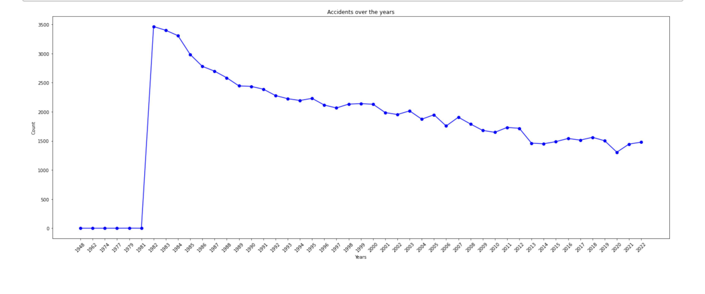
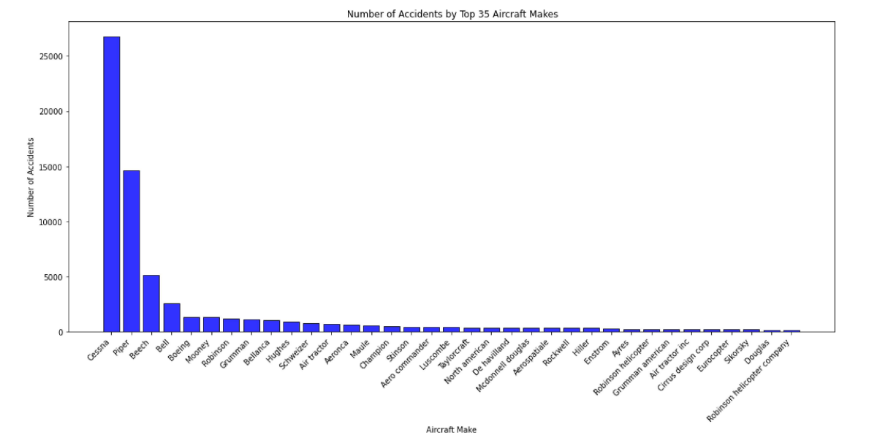
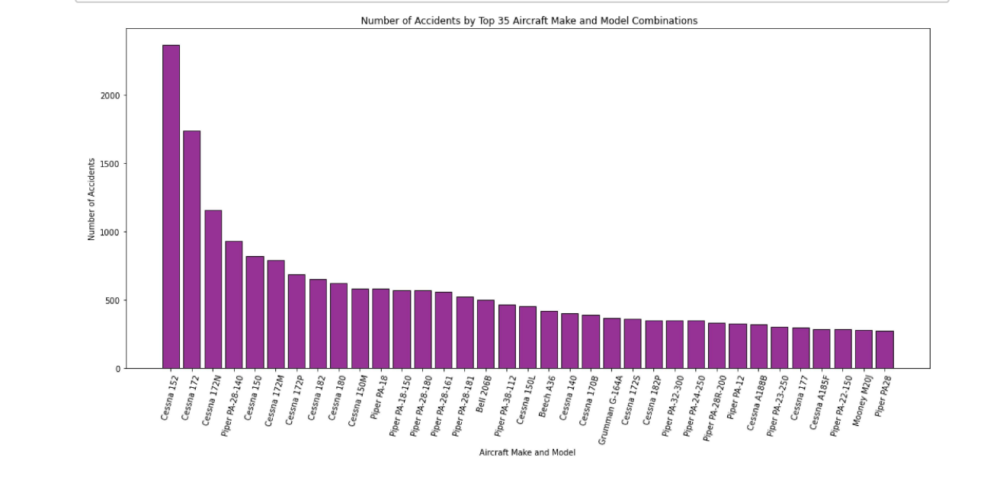
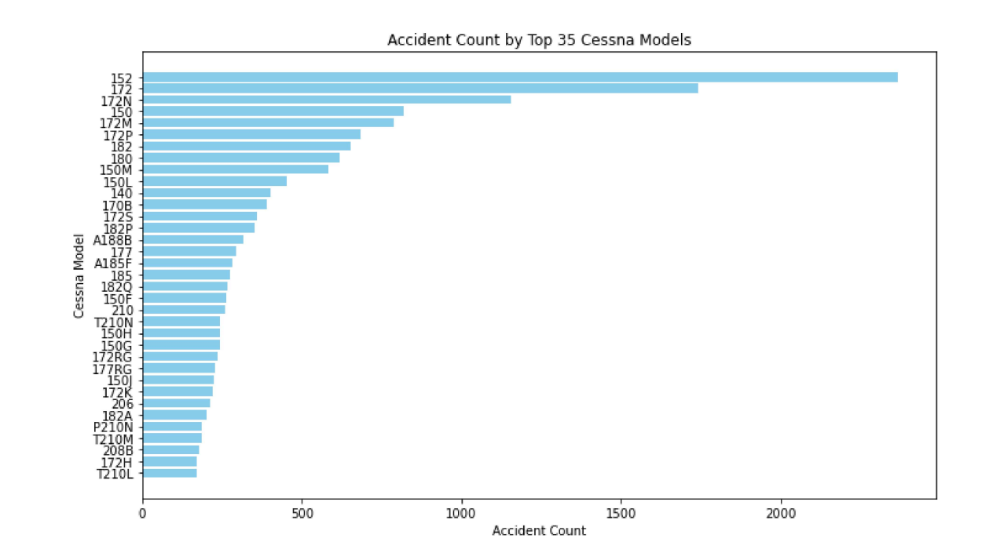
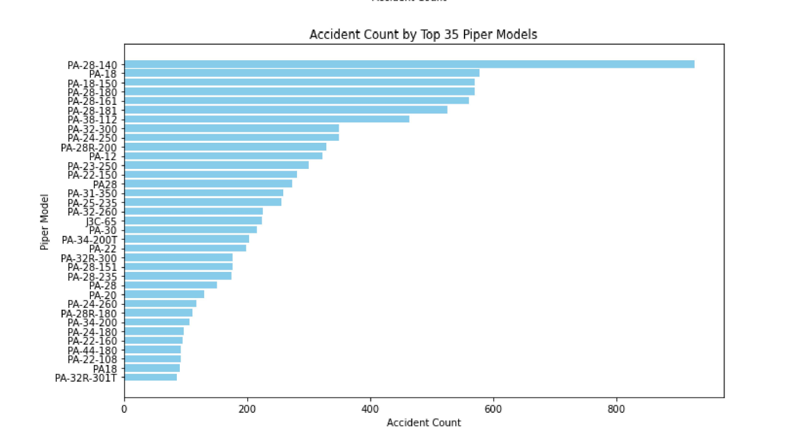
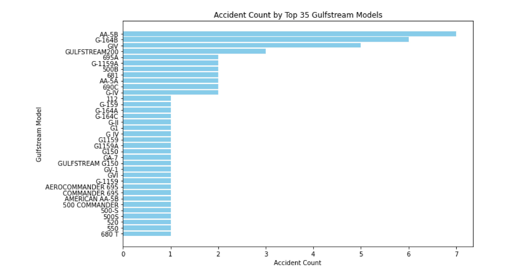
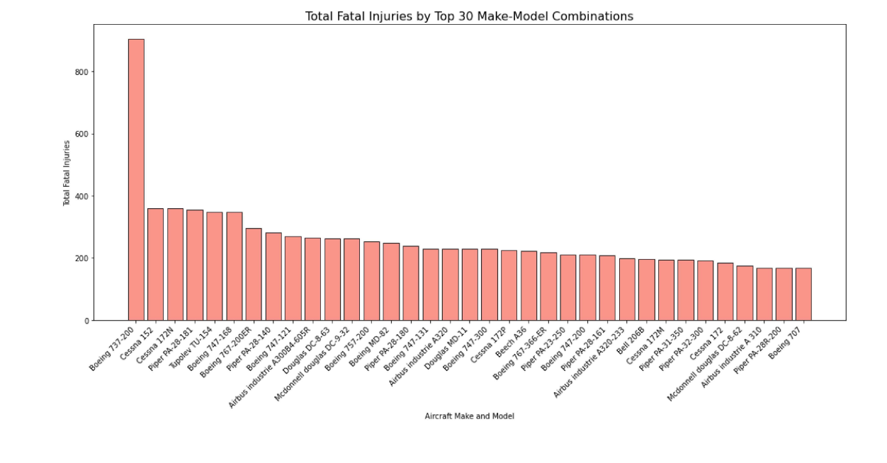
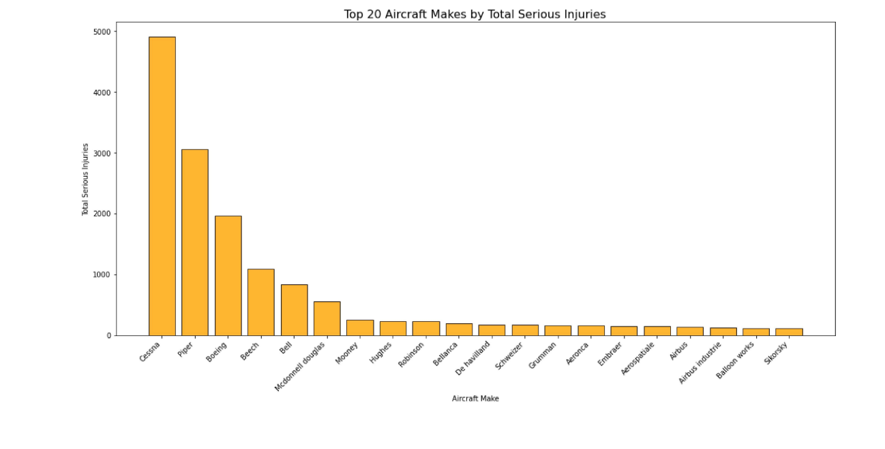
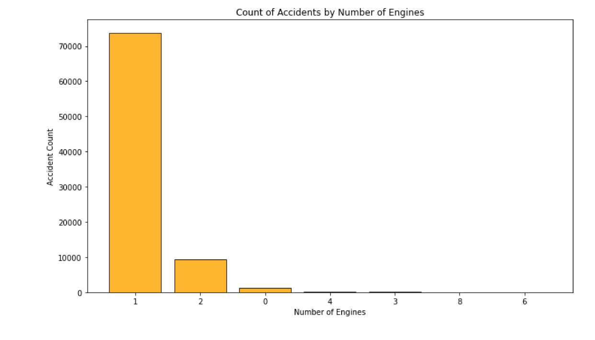
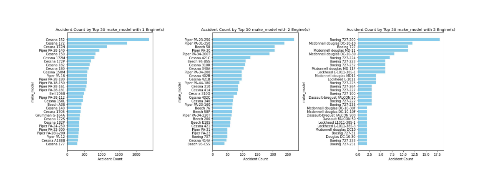

# AVIATION RISK ANALYSIS: IDENTIFYING LOW-RISK AIRCRAFT FOR BUSINESS EXPANSION
## **Author:** Ian Bett
***

## Overview

The aviation industry presents significant opportunities for business expansion, but it also comes with inherent risks. This project aims to provide actionable insights into aircraft safety to guide informed decisions for investing in commercial and private aviation. Using a dataset from the National Transportation Safety Board (NTSB), which includes detailed records of aviation accidents, I analyzed key factors such as aircraft make, model, engine type, number of engines and weather conditions. By leveraging statistical methods and data visualizations, we identified trends and risk factors associated with different aircraft types. Our findings offers data-driven recommendations to minimize risk and optimize investment decisions, focusing on the safest and most reliable aircraft makes and models.

## Business Problem

My company is expanding into the aviation industry to diversify its portfolio. The goal is to identify the safest and lowest-risk aircraft for both commercial and private operations. The aviation industry carries significant safety risks, and understanding the patterns and causes of accidents is critical to making informed decisions about which aircraft to purchase. This analysis will help the company reduce risks and ensure a successful entry into the new industry.

#### Business Pain Points
- **Safety Concerns**: Aviation accidents can result in significant financial losses and damage to reputation. The company needs to minimize the risk of accidents by selecting reliable and safe aircraft.
- **Knowledge Gap**: The company lacks expertise in evaluating aircraft safety and understanding which factors contribute to higher accident risks.
- **Decision Support**: Without data-driven insights, choosing the right aircraft could be a costly and risky endeavor.

#### Data Analysis Questions
The following questions were chosen to address the business's needs:
1. **Which aircraft makes and models have the highest and lowest accident counts?**
   - Helps identify safer aircraft and avoid those with a history of frequent accidents.
2. **What are the patterns of accidents based on engine type and number of engines?**
   - Provides insights into the reliability of different engine configurations and helps assess risks associated with specific aircraft types.
3. **How do meteorological conditions (VMC vs. IMC) impact accident counts?**
   - Helps evaluate risks related to operating conditions and aids in planning operational strategies.
4. **Which aircraft make or model is associated with the most or least severe outcomes, such as fatalities or serious injuries?**
   - Identifies aircraft with better safety.

#### Importance to the Business
Answering these questions is critical for making informed decisions about aircraft purchases. By understanding accident trends and identifying low-risk aircraft:
- The company can mitigate potential losses and liabilities.
- It ensures better operational safety and reliability.
- The findings can shape future policies, such as pilot training or maintenance schedules, based on aircraft-specific risks.

These insights provide the foundation for data-driven recommendations that align with the company’s goal of entering the aviation industry successfully and safely.

## Data Understanding

#### Data Source
The dataset used for this project was sourced from [Kaggle](https://www.kaggle.com/datasets/khsamaha/aviation-accident-database-synopses). It contains detailed information about aviation accidents, which is critical for analyzing risks associated with different aircraft types.

#### Data Representation
The data represent aviation accident records, primarily including information about aircraft make, model, engine type, number of engines, and accident outcomes such as injuries and fatalities. 

Key variables included in the dataset are:
- **Make and Model**: Specifies the manufacturer and model of the aircraft.
- **Injury Severity**: Indicates whether the accident resulted in to fatal or unfatal injuries.
- **Total Fatal Injuries**: The number of fatalities per accident.
- **Total Serious Injuries**: The number of serious injuries per accident.
- **Meteorological Conditions**: Specifies whether the accident occurred under Visual Meteorological Conditions (VMC) or Instrument Meteorological Conditions (IMC).
- **Engine Type**: Type of engine powering the aircraft (e.g., Reciprocating, Turbo Shaft, Turbo Prop, Turbo Fan).
- **Number of Engines**: The number of engines on the aircraft.

#### Target Variable
The target variable for this analysis is the **"Total fatal injuries"** column, which represents the total number of fatalities in an accident. This variable is crucial for identifying high-risk aircraft and assessing safety.

#### Variable Properties
The key variables intended for use have the following properties:
- **Categorical Variables**:
  - `investigation type`: We'll focus on accidents only rather than incidents.
  - `make & model`: Combines aircraft make and model for detailed analysis.
  - `engine type`: Identifies the type of engine powering the aircraft.
  - `number of engines`: Categorizes aircraft by the number of engines.
  - `injury severity`: Classifies accidents based on injury outcomes.
- **Numerical Variables**:
  - `Total fatal injuries`: Represents the total number of fatalities.
  - `Total serious injuries`: Represents the total number of serious injuries.
  

## Data Analysis

  
To address these questions I had posed at the onset of this project, various charts and graphs were used to uncover patterns and provide actionable insights:  

1. **Line Charts**:  
   - **Trends in Accidents Over Time**: Visualized the number of accidents from 1948 to 2022, revealing historical trends and changes in safety.  

2. **Bar Charts**:  
   - **Accident Severity**: Compared the total counts of fatal and non-fatal injuries over the years, offering a clear picture of accident outcomes.  
   - **Accident Counts by Aircraft Make and Model**: Identified aircraft makes and models with the highest and lowest accident counts to guide risk assessments.  
   - **Accident Patterns by Engine Type and Number of Engines**: Explored the relationship between engine configurations and accident frequency, shedding light on aircraft reliability.  
   - **Accident Counts by Meteorological Conditions**: Highlighted differences in accident rates under Visual Meteorological Conditions (VMC) and Instrument Meteorological Conditions (IMC), informing strategies for safer operations.  

---

### Tools and Methods  
- **Data Processing**: Used **pandas** to clean, aggregate, and analyze the dataset effectively.  
- **Visualization**: Employed **Matplotlib** and **Seaborn** to create clear and impactful visualizations tailored for non-technical stakeholders.  

These analyses laid the groundwork for actionable recommendations, ensuring that the business's aviation expansion is based on robust, data-driven insights.

## Trend Analysis 

The below line chart shows the count of accidents over the years, with the most count of accidents being in 1982.

## Bar plot showing the count of total fatal and non-fatal injuries through out the years

## Bar plot showing the count of accidents by top 35 aircaft make

###  Insights
- **Cessna and Piper dominate** the accident dataset. This is likely a result of their popularity and widespread usage in general aviation and training, which increases exposure to accidents.
- The presence of manufacturers like **Boeing** and **Bell** suggests the dataset includes a mix of commercial airliners and specialized aircraft like helicopters.
- The smaller accident numbers for less common manufacturers, such as **Taylorcraft** and **Luscombe**, could be due to their limited production and operation scale.

Overall, the distribution of accident counts aligns with the operational scale and popularity of these aircraft, with more commonly used makes experiencing higher accident counts.

##  Bar chart showing the top 35 aircraft make and model combinations with the highest number of accidents

## Horizontal Bar graphs showing the accident count of 10 Common aircraft make grouped by model

### Recommendations for Popular Aircraft Models Based on Accident Counts

#### Models to Avoid (Higher Accident Counts)
To reduce risk, the following aircraft models with higher accident counts should be avoided:

- **Cessna Models**:  
  - 152, 172, 172N, 150, 172M, 172P, 182, 180, 150M  

- **Piper Models**:  
  - PA-28-140, PA-18, PA-18-150, PA-28-180, PA-28-161, PA-28-181, PA-38-112  

- **Beech Models**:  
  - A36, 58, C23, V35B, 35, 95-B55, F33A, 23  

- **Boeing Models**:  
  - 737, A75N1, B75N1, E75, 737-200, A75N1(PT17)  

- **Bell Models**:  
  - 206B, 206, 206L-1, 407, 47G, 206L-3  
 

#### Models to Consider (Lower Accident Counts)
Aircraft models with lower accident counts are recommended for safer operations.

- **Cessna Models**:  
  - T210L, 208B, P210N, 182A

- **Piper Models**:  
  - PA-22-108, PA-32R-301T
  
- **Beech Models**:  
  - A23-24 , 95-C55
  
- **Boeing Models**:  
  - 747-422

- **Bell Models**:  
  - 430, 222

- **Gulfstream Models**: 
  - 550, 680T, 500S

- **Airbus Models**: 
  - 330, 321, A319-132, A321-211, AS-350
 
  

## Bar chart showing Total Fatal Injuries by  top 35 Aircraft Makes 

## Bar chart showing Total Fatal Injuries by Top 35 Make-Model Combinations 

### Aircraft Models to Avoid by Make since the have a high fatality count

#### Boeing       
- 737-200, 747-168, 747-121, 747-131, 747-200, 747-300, 757-200, 767-200ER, 767-366-ER, 707  

#### Cessna
- 152, 172, 172N, 172M, 172P  

#### Piper
- PA-28-140, PA-28-161, PA-28-180, PA-28-181, PA-28R-200, PA-31-350, PA-32-300, PA-23-250  

#### Airbus Industrie
- A30084-605R, A320, A320-233,A310  

#### Tupolev
- TU-154  

#### Douglas
- DC-8-63, DC-8-62, MD-11  

#### McDonnell Douglas
- DC-9-32, MD-82  

#### Beech
- A36  

#### Bell
- 206B  
  

## Top 20 total serious injuries by make

## Top 20 total serious injuries by make and model

**The above aircraft makes and models should be avoided at all cost, they still appear under aircraft Models and makes to Avoid by Total Fatal injuries.**

## Bar chart showing Count of accidents by engine type

### Insights from the Bar Chart: Engine Types and Accident Counts

 **Key Finding:**  
Aircraft equipped with **Reciprocating engines** have the **highest count of accidents** compared to other engine types.

---

### Focus on Major Engine Types in Commercial Aviation  
The chart highlights accident counts across the **four major engine types** commonly found in commercial airplanes:

1. **Reciprocating Engines**   
   - Highest accident count, signaling the need for deeper analysis and improved safety measures.  

2. **Turbo Shaft Engines**   
   - Typically found in helicopters; exhibits a moderate level of accident occurrences.  

3. **Turbo Prop Engines**   
   - Used in smaller regional aircraft; shows lower accident counts compared to reciprocating engines.  

4. **Turbo Fan Engines**   
   - Found in large commercial jets; demonstrates a relatively low accident rate, reflecting advanced safety standards.  

---

### Takeaway:  
This data emphasizes the need for targeted safety measures and maintenance practices, particularly for **reciprocating engine aircraft**, to reduce accident rates.

## Bar chart showing the count of accidents grouped by number of engines:

**The above bar chart shows that most aircrafts with only one engine have the highest number of accidents.**

## Bar charts showing the accident counts by make & model engine type

## Recommended Aircraft by Engine Type Based on Lowest Accident Counts

Based on the bar charts, the following aircraft makes and models are recommended for purchase, as they have the least number of accidents for their respective engine types:

---

###  **Reciprocating Engine**
- Piper PA-23-250
- Cessna 177
- Piper PA-32-300

###  **Turbo Shaft Engine**
- McDonnell Douglas Helicopter 369E
- Bell 206BIII
- Sikorsky S-76A

###  **Turbo Prop Engine**
- Beech 99
- Cessna 425

###  **Turbo Fan Engine**
- Cessna 560XL 
- Boeing 737-7H4  
- Boeing 747-400 
- McDonnell Douglas DC-9-82  
- McDonnell Douglas DC-10-30  
- Boeing 757-222  
- Cessna 525A  
- Boeing 767

## Bar charts showing the accident counts by make & model number of engines

##  Recommended Aircraft by Engine Number Based on Lowest Accident Counts

Based on the bar charts, the following aircraft makes and models are recommended for purchase, as they have the **least number of accidents** for their respective engine configurations:

###  **Single Engine Aircraft**  
- Piper PA-24-250
- Cessna 177
- Piper PA-32-300  

###  **Twin Engine Aircraft**  
- Cessna 414A  
- Piper PA-31  

###  **Triple Engine Aircraft**  
- Boeing 727-251
- Douglas DC-10-30  

### Bar charts showing accident counts based on two weather conditions

The graph above highlights that most occurrences involve Visual Meteorological Conditions (VMC), with significantly fewer cases for Instrument Meteorological Conditions (IMC).

## Conclusions

### Recommendations
Based on the analysis conducted, the following recommendations are proposed for the business:  
1. **Focus on Low-Risk Aircraft**: Prioritize purchasing aircraft models and makes with lower accident counts and minimal severe outcomes, such as fatalities or serious injuries, which aligns with the goal of reducing operational risks. They are the following: 

### Models to Consider (Lower Accident Counts)
Aircraft models with lower accident counts are recommended for safer operations.

- **Cessna Models**:  
  - T210L, 208B, P210N, 182A

- **Piper Models**:  
  - PA-22-108, PA-32R-301T
  
- **Beech Models**:  
  - A23-24 , 95-C55
  
- **Boeing Models**:  
  - 747-422

- **Bell Models**:  
  - 430, 222

- **Gulfstream Models**: 
  - 550, 680T, 500S

- **Airbus Models**: 
  - 330, 321, A319-132, A321-211, AS-350
 

2. **Engine Type and Configuration**: Invest in aircraft with reliable engine configurations, such as those with turbo-prop & turbo-fan engines, as these were associated with consistent safety records in the analysis. They are the following:

---

## Based on engine type

####  **Reciprocating Engine**
- Piper PA-23-250
- Cessna 177
- Piper PA-32-300

####  **Turbo Shaft Engine**
- McDonnell Douglas Helicopter 369E
- Bell 206BIII
- Sikorsky S-76A

####  **Turbo Prop Engine**
- Beech 99
- Cessna 425

####  **Turbo Fan Engine**
- Cessna 560XL 
- Boeing 737-7H4  
- Boeing 747-400 
- McDonnell Douglas DC-9-82  
- McDonnell Douglas DC-10-30  
- Boeing 757-222  
- Cessna 525A  
- Boeing 767

## Based on number of Engine(s)

####  **Single Engine Aircraft**  
- Piper PA-24-250
- Cessna 177
- Piper PA-32-300  

####  **Twin Engine Aircraft**  
- Cessna 414A  
- Piper PA-31  

####  **Triple Engine Aircraft**  
- Boeing 727-251
- Douglas DC-10-30  

3. **Operational Planning**: Develop operational strategies that favor Instrument Meteorological Conditions (IMC), as these conditions have significantly fewer accidents compared to  Visual Meteorological Conditions (VMC).

### Limitations
While the analysis provides actionable insights, there are some limitations to consider:  
-  Missing or inconsistent data, such as unknown weather conditions or incomplete records, could impact the accuracy of the findings.  
- External factors, such as pilot experience, maintenance records, or geographical considerations, aircraft year of manufacture were not recorded. 
  

### Next Steps
To further improve this project and provide more robust recommendations, I suggest that one should:  
1. Include additional variables like pilot experience, aircraft age & year of manufacture, and maintenance history to better understand their impact on safety.  
2. Use a more recent and comprehensive dataset to capture trends in modern aviation safety.  
3. Use machine learning models to predict the likelihood of accidents based on aircraft features and operational conditions.  

